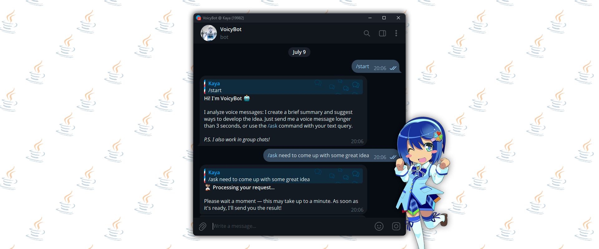

 
# VoicyBot 🎤
**VoicyBot** is a **Telegram bot** that **processes voice messages**, **provides summaries** and **expands ideas**. It supports both **voice messages** and **manual text prompts**.

## ✨ Features
- 🎙️ Voice message analysis (speech-to-text)
- 📝 Automatic summarization of voice content
- 💡 Idea development and expansion
- 📌 Text prompt support via `/ask` command

## ⚙️ Requirements
- Java 17+
- Maven 3.6+
- Telegram Bot token from [@BotFather](https://t.me/BotFather)
- Vosk model (can be obtained from [here](https://github.com/alphacep/vosk-space/blob/master/models.md))
- FFmpeg
- API key on [OpenRouter](https://openrouter.ai)

## 🚀 Quick start
1. Obtain everything listed in Requirements section
2. Fill out your config
    - Use template located in: `src/main/resources/config.yaml.template`
3. Build and run the app

## License 📄
This project is licensed under the [MIT License](LICENSE) - so do whatever you want with it, just don't blame me if something goes sideways.